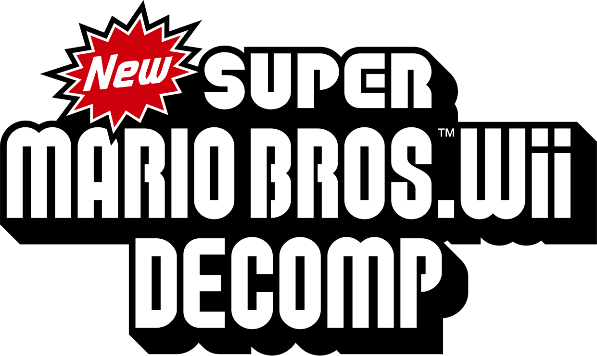

## Main Page

Welcome to the New Super Mario Bros. Wii decompilation project!

[TOC]

### Introduction
New Super Mario Bros. Wii was written in a mix of C and C++ and then compiled to PowerPC (PPC) [assembly code](https://en.wikipedia.org/wiki/Assembly_language) by the **Metrowerks CodeWarrior** compiler. While C/C++ code is not directly executable, PPC Assembly Code can be run directly on the Wii's hardware.

The final game only includes the PPC assembly code, and it's highly unlikely that the original C/C++ code for the game will ever be made public. The objective of this decompilation project is to reconstruct the latter to gain insights into how the game functions, making it easier to implement changes.

### Code Structure

#### Physical Structure
The game's code is physically divided into five files:
- @ref dol "main.dol"
- @ref profileNP "d_profileNP.rel.LZ"
- @ref basesNP "d_basesNP.rel.LZ"
- @ref enemiesNP "d_enemiesNP.rel.LZ"
- @ref bossNP "d_en_bossNP.rel.LZ"

This division, while providing modularity during the development process, likely originates from a size limit for `main.dol`, imposed by Nintendo on all Wii game developers.

`main.dol` is the game's primary executable, akin to an `.exe` file for the Wii. It's loaded by the disc loader (usually the Wii Menu) and is [statically linked](https://www.baeldung.com/cs/static-dynamic-linking-differences#static-linking), meaning it always loads to the same memory location.

The `.rel.LZ` files hold most of the game-specific code and operate in a manner similar to `.dll` files on Windows. They are [dynamically loaded and linked](https://www.baeldung.com/cs/static-dynamic-linking-differences#dynamic-linking) after the health and safety screen by dedicated code in `main.dol`. Although they are technically relocatable, meaning they could load at different memory addresses each time, due to the deterministic nature of the game's early code they consistently load at the same address.

The decompilation aims to provide matching C/C++ code for all of these files.

#### Logical Structure
The game code can be logically divided into five major components, each comprising multiple sub-components:
- A @ref stdlib "PowerPC implementation" of the [C Standard Library](https://en.wikipedia.org/wiki/C_standard_library).
- The @ref rvl, a framework providing a set of tools, libraries and APIs that game developers can use to interface with the Wii's hardware in a secure and controlled manner. It is written in C and is used in every Wii game.
- @ref nw4r (NintendoWare 4 Revolution), a middleware library providing utilities for graphics, audio and text rendering, disc reading, debugging and more. It includes several proprietary file formats and associated export tools. NW4R is written in C++ and accessible to third-party developers upon request.
- @ref egg, another middleware library providing higher-level utilities on top of the @ref rvl. It is written in C++ and is not available to third-party developers.
- Anything else not falling into the categories mentioned above constitutes [game-specific code](#game-specific-code-structure), although there are indications that parts of it belong to a makeshift game engine, extensively reused by Nintendo during that time period.

#### Game-Specific Code Structure
Thanks to the [symbols we have recovered](https://rootcubed.dev/nsmbw-symbols/), we can divide the @ref game "game-specific code" into several parts as follows:
- @ref framework "The base game framework" (classes prefixed with `f`) is the core of the game engine. _If you want to learn how the game works, start from here._
- The @ref slib "s" library is comprised of math utilities and, most importantly, the state system.
- The @ref mlib "m" library wraps the functionality of @ref egg, @ref nw4r and the @ref rvl to provide even higher level APIs.
- The @ref snd library provides an application layer sound API.
- @ref clib "Various utility classes" can be found under the `c` prefix.
- @ref game "Anything else left" (mostly classes prefixed with `d`) is truly game-specific code.
